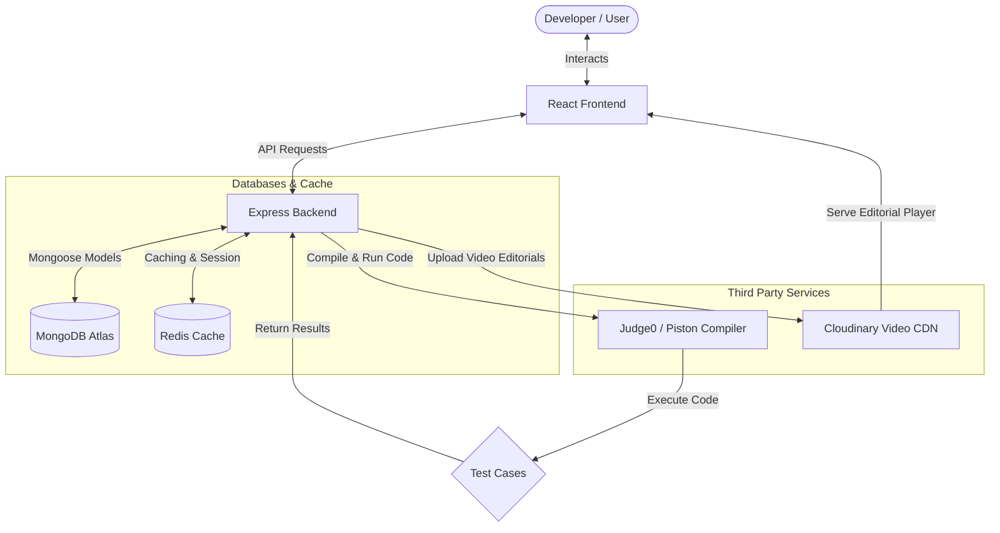

# 🌌 AlgoSphere


AlgoSphere is a premium, full-stack online coding judge platform that allows developers to solve algorithm challenges, compile and run code in real-time, trace their submission statistics, climb a global leaderboard, and review video solution editorials.

> [!TIP]
> **Dynamic theme toggling** is supported globally. Use the Sun/Moon icons in the toolbar to switch layouts and synchronize the Monaco Editor theme instantly!

## 📸 Visual Preview

### Practice Lobby (Homepage)


### User Profile Analytics Dashboard (Apple rings & GitHub heatmap)


### Global Leaderboard (High Contrast Light/Dark Mode Toggle)


### Admin Management Control Panel


### Authentication Portals
| Login Page | Signup Page |
| :---: | :---: |
|  |  |

---

## 🚀 Key Features

### 💻 1. Interactive Coding Workspace
* **Monaco Editor Integration**: Write solutions in a VS Code-style editor with syntax highlighting, autocomplete, and auto-formatting.
* **Multi-Language Support**: Supports **C++**, **Java**, and **JavaScript** execution.
* **Stopwatch Coding Timer**: Integrated widget next to language selection counting minutes and seconds (`MM:SS`) with play, pause, reset, and hide controls.
* **Test Case Sandbox**: Compile and execute code against custom visible inputs with detailed stdout and run results.

### 📊 2. User Profile Analytics (Apple & GitHub Style)
* **Concentric Progress Ring Gauges**: Apple Watch-style concentric circular SVG progress rings showing completion rates for **Easy**, **Medium**, and **Hard** problems.
* **GitHub-Style Contribution Heatmap**: A custom interactive 365-day grid tracking daily submission frequencies with detailed hover tooltips.
* **Topic Proficiency Meters**: Solved-to-total progress indicators tracking topic stats (Arrays, Dynamic Programming, LinkedLists, Graphs).
* **Active Streak Tracker**: Calculates and displays current consecutive coding days.
* **Interactive Solved List**: A scrollable index of all solved challenges with direct practice links.

### 🏆 3. Global Leaderboard & Gamification
* **Podium Crown Highlights**: Gold, Silver, and Bronze crown podium banners for the top 3 ranked developers.
* **Points Tallying System**: Ranks are computed dynamically using problem difficulties:
  * Easy = 10 pts
  * Medium = 30 pts
  * Hard = 100 pts
* **Rankings Table**: Sorts all platform users by points, solved breakdown, total submissions, and execution accuracy percentage.

### 🌓 4. Dynamic Theme Toggle (Light & Dark Mode)
* **Global Theme Switcher**: Toggle between a sleek dark glassmorphism SaaS interface and a soft, high-contrast slate-white light theme.
* **Dynamic Monaco Theme Sync**: Switches the Monaco Editor canvas between `vs-dark` and `light` dynamically on theme toggle.

### 📹 5. Video Solution Editorials
* **Embedded Video Player**: View editorial video solutions directly in the workspace under the "Editorial" tab.
* **Admin Upload Interface**: Admin dashboard supporting direct, signed video uploads to Cloudinary.

---

## 🛠️ Tech Stack

* **Frontend**: React 19, Redux Toolkit, Tailwind CSS v4, DaisyUI, Lucide React, Monaco Editor.
* **Backend**: Node.js, Express, MongoDB, Mongoose, Redis.
* **Third-Party Services**:
  * **Judge0 / Piston**: Remote execution sandbox for compiling and evaluating code.
  * **Cloudinary**: Cloud video hosting and media asset management.

---

## 📐 System Architecture

This diagram shows how different components and services interact within **AlgoSphere**:



### Architectural Flow Explanation:

1. **Client-Side (React)**: Represents the developer workspace. It renders the Monaco code editor, handles timing states, and makes API calls to compile code, verify login status, or fetch scores.
2. **Server-Side (Express)**: Orchestrates routes, enforces JWT cookies authentication, and handles communication with secondary services.
3. **Database & Cache (MongoDB / Redis)**:
   * **MongoDB Atlas** stores permanent entities (Users, Problems, Submissions).
   * **Redis Cache** caches frequently read dashboards (like Leaderboard positions) to guarantee fast access speeds.
4. **Third-Party Compilers & Storage**:
   * **Piston Compiler** runs code submissions in isolated sandboxes and checks against visible/hidden test cases.
   * **Cloudinary** holds solution editorials videos, streaming them directly to the client's workspace.

---

## 📂 Project Structure

Below is the directory tree mapping showing the file structure of both the `client` and `server` folders in **AlgoSphere**:

```text
AlgoSphere/
├── client/                     # Frontend Application (React)
│   ├── public/                 # Static public assets
│   └── src/
│       ├── assets/             # Images and styles assets
│       ├── components/         # Reusable UI widgets
│       │   ├── AdminUpdate.jsx # Problem update dashboard view
│       │   ├── ChatAi.jsx      # Gemini/ChatGPT-style coding helper
│       │   └── SubmissionHistory.jsx # Submissions list & code preview
│       ├── pages/              # Main route views
│       │   ├── Home.jsx        # Dashboard problem lobby
│       │   ├── Leaderboard.jsx # Podium rankings table
│       │   ├── Login.jsx       # Authentication access
│       │   ├── ProblemPage.jsx # Code editor workspace & compiler
│       │   ├── Profile.jsx     # Concentric progress rings & heatmap
│       │   └── Signup.jsx      # Guest registration portal
│       ├── App.jsx             # Main Router navigation mapping
│       ├── index.css           # Global stylesheets & Light overrides
│       └── main.jsx            # Entry point render
├── server/                     # Backend API Server (Node.js & Express)
│   └── src/
│       ├── config/             # Database connection setups
│       │   ├── db.js           # Mongoose MongoDB connection
│       │   └── redis.js        # Redis cache configuration
│       ├── controllers/        # Route query controllers
│       │   ├── userAuth.js     # User registration/login controllers
│       │   └── userProblem.js  # Solved counters, heatmaps, & ranking
│       ├── Models/             # Mongoose schemas
│       │   ├── problem.js      # Code templates & test cases schema
│       │   ├── submission.js   # User submission records schema
│       │   └── user.js         # Score, solved list, & avatar schema
│       ├── routes/             # API routing channels
│       │   ├── userAuth.js     # Auth route endpoints
│       │   └── problemCreator.js # Practice playground route endpoints
│       └── index.js            # Main backend entry point
├── .gitignore                  # Git untracked files setup
└── README.md                   # Project documentation
```

---

## ⚙️ Installation & Local Setup

### 1. Clone the repository
```bash
git clone https://github.com/Har-2505/AlgoSphere.git
cd AlgoSphere
```

### 2. Configure Environment Variables
Create a `.env` file in the `server` directory:

```env
PORT=3000
DB_CONNECT_STRING=mongodb+srv://<username>:<password>@<cluster>.mongodb.net/AlgoSphere
JWT_KEY=your_jwt_secret_key
REDIS_PASS=your_redis_password
PISTON_URL=http://localhost:2000
GEMINI_API_KEY=your_gemini_api_key
CLOUDINARY_CLOUD_NAME=your_cloud_name
CLOUDINARY_API_KEY=your_api_key
CLOUDINARY_API_SECRET=your_api_secret
```

### 3. Install dependencies and start the application

#### Setup Backend:
```bash
cd server
npm install
node src/index.js
```

#### Setup Frontend:
```bash
cd client
npm install
npm run dev
```

---

## 🔒 Security Best Practices
* **No Hardcoded Secrets**: All database strings, JWT keys, and third-party credentials are managed strictly through `.env` configurations.
* **Environment Files Ignored**: `.env` is listed inside `.gitignore` to prevent secret leaks on public repositories.

> [!CAUTION]
> Never push your local `.env` file or any credentials to public GitHub repositories. Keep database connections secure by using system environment variables.