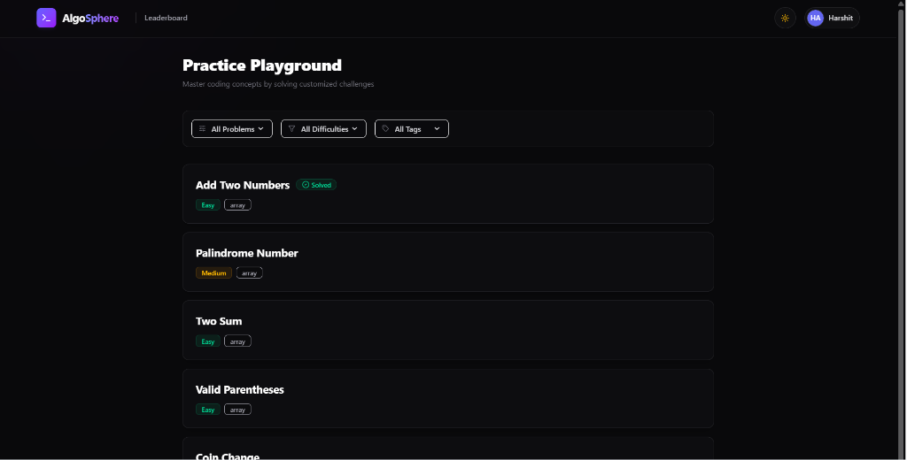
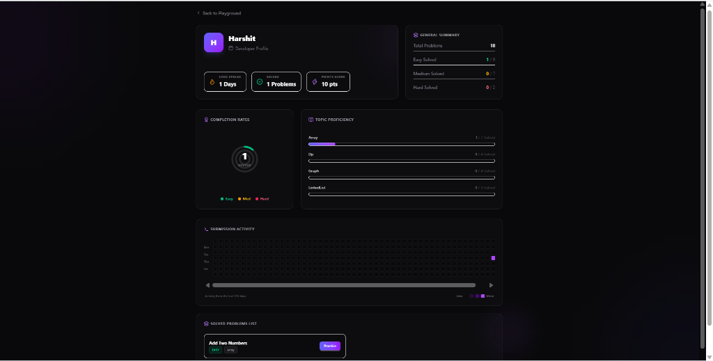
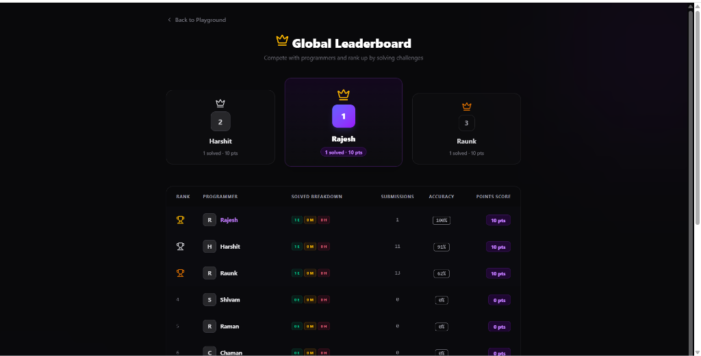
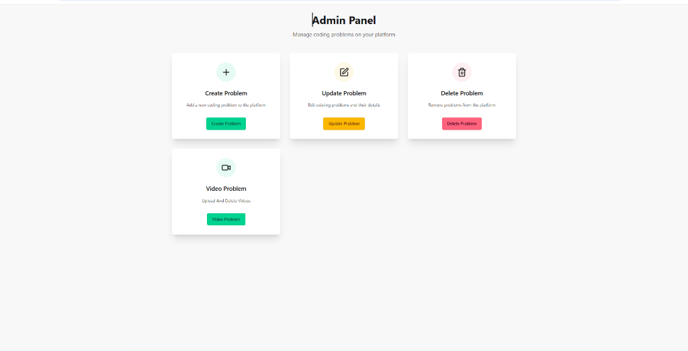
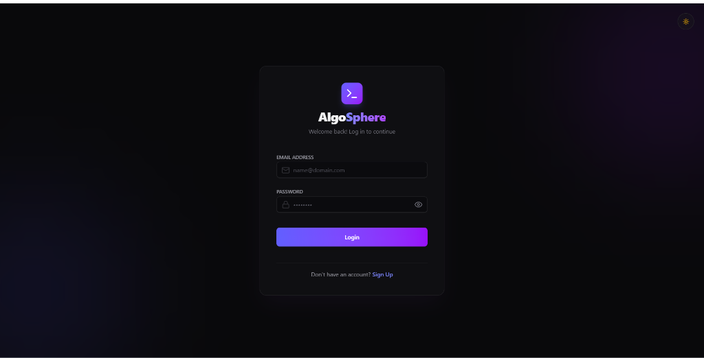
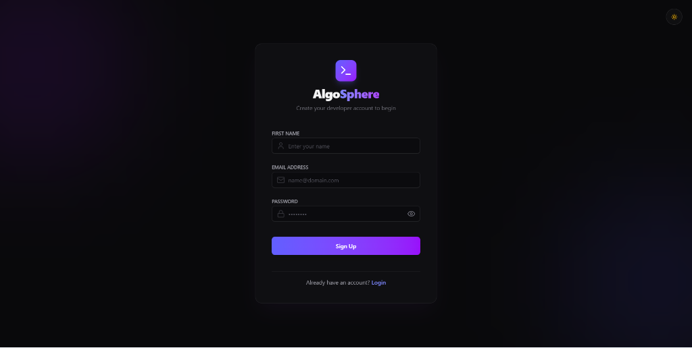
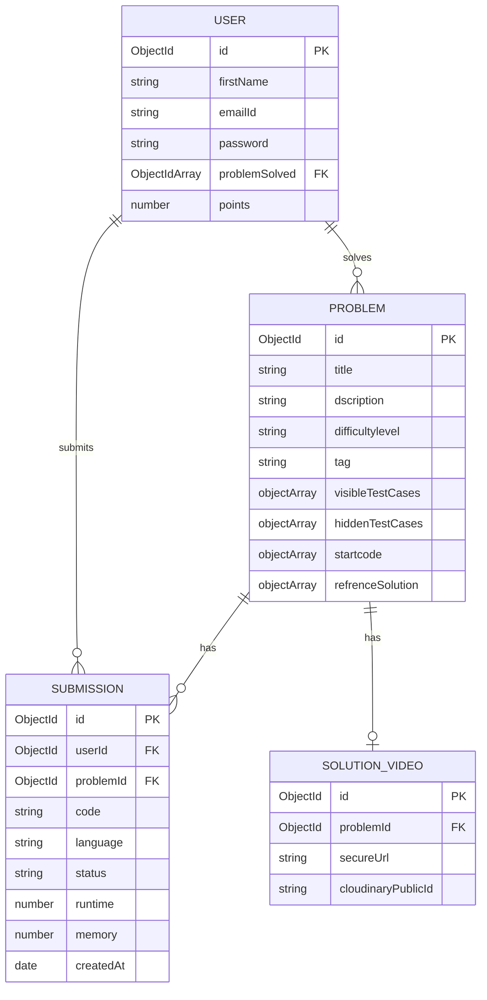

# 🌌 AlgoSphere


AlgoSphere is a premium, full-stack online coding judge platform that allows developers to solve algorithm challenges, compile and run code in real-time, trace their submission statistics, climb a global leaderboard, and review video solution editorials.

> [!TIP]
> **Dynamic theme toggling** is supported globally. Use the Sun/Moon icons in the toolbar to switch layouts and synchronize the Monaco Editor theme instantly!

---

## ❓ Why AlgoSphere?

Traditional coding platforms often present a steep learning curve and lack personalized, interactive resources. **AlgoSphere** was built to solve these gaps by creating a premium, self-hosted coding ecosystem:

* **Interactive AI Assistance**: Avoid getting stuck. AlgoSphere features an integrated AI Chat Assistant directly in the workspace to explain algorithm constraints, debug syntax issues, and provide conceptual hints.
* **Apple Watch-Style Progress Rings**: Simple percentages are boring. AlgoSphere translates coding milestones into Apple-style concentric Rings and weekly contribution Heatmaps, giving developers a tactile, rewarding sense of completion.
* **Gamified Leaderboards**: Climbing a visual Gold/Silver/Bronze crown podium keeps users engaged and fosters friendly competition.
* **Direct Video Solution Editorials**: Instead of forcing developers to leave the platform to search YouTube, administrators can host direct explanation videos right next to the code editor.

---

## 📸 Visual Preview

### Practice Lobby (Homepage)


### User Profile Analytics Dashboard (Apple rings & GitHub heatmap)


### Global Leaderboard (High Contrast Light/Dark Mode Toggle)


### Admin Management Control Panel


### Authentication Portals
| Login Page | Signup Page |
| :---: | :---: |
|  |  |

---

## 🚀 Key Features

### 💻 1. Interactive Coding Workspace
* **Monaco Editor Integration**: Write solutions in a VS Code-style editor with syntax highlighting, autocomplete, and auto-formatting.
* **Multi-Language Support**: Supports **C++**, **Java**, and **JavaScript** execution.
* **Stopwatch Coding Timer**: Integrated widget next to language selection counting minutes and seconds (`MM:SS`) with play, pause, reset, and hide controls.
* **Test Case Sandbox**: Compile and execute code against custom visible inputs with detailed stdout and run results.

### 📊 2. User Profile Analytics (Apple & GitHub Style)
* **Concentric Progress Ring Gauges**: Apple Watch-style concentric circular SVG progress rings showing completion rates for **Easy**, **Medium**, and **Hard** problems.
* **GitHub-Style Contribution Heatmap**: A custom interactive 365-day grid tracking daily submission frequencies with detailed hover tooltips.
* **Topic Proficiency Meters**: Solved-to-total progress indicators tracking topic stats (Arrays, Dynamic Programming, LinkedLists, Graphs).
* **Active Streak Tracker**: Calculates and displays current consecutive coding days.
* **Interactive Solved List**: A scrollable index of all solved challenges with direct practice links.

### 🏆 3. Global Leaderboard & Gamification
* **Podium Crown Highlights**: Gold, Silver, and Bronze crown podium banners for the top 3 ranked developers.
* **Points Tallying System**: Ranks are computed dynamically using problem difficulties:
  * Easy = 10 pts
  * Medium = 30 pts
  * Hard = 100 pts
* **Rankings Table**: Sorts all platform users by points, solved breakdown, total submissions, and execution accuracy percentage.

### 🌓 4. Dynamic Theme Toggle (Light & Dark Mode)
* **Global Theme Switcher**: Toggle between a sleek dark glassmorphism SaaS interface and a soft, high-contrast slate-white light theme.
* **Dynamic Monaco Theme Sync**: Switches the Monaco Editor canvas between `vs-dark` and `light` dynamically on theme toggle.

### 📹 5. Video Solution Editorials
* **Embedded Video Player**: View editorial video solutions directly in the workspace under the "Editorial" tab.
* **Admin Upload Interface**: Admin dashboard supporting direct, signed video uploads to Cloudinary.

---

## 🛠️ Tech Stack

* **Frontend**: React 19, Redux Toolkit, Tailwind CSS v4, DaisyUI, Lucide React, Monaco Editor.
* **Backend**: Node.js, Express, MongoDB, Mongoose, Redis.
* **Third-Party Services**:
  * **Judge0 / Piston**: Remote execution sandbox for compiling and evaluating code.
  * **Cloudinary**: Cloud video hosting and media asset management.

---

## 📐 System Architecture

This diagram shows how different components and services interact within **AlgoSphere**:


### Architectural Flow Explanation:

1. **Client-Side (React)**: Represents the developer workspace. It renders the Monaco code editor, handles timing states, and makes API calls to compile code, verify login status, or fetch scores.
2. **Server-Side (Express)**: Orchestrates routes, enforces JWT cookies authentication, and handles communication with secondary services.
3. **Database & Cache (MongoDB / Redis)**:
   * **MongoDB Atlas** stores permanent entities (Users, Problems, Submissions).
   * **Redis Cache** caches frequently read dashboards (like Leaderboard positions) to guarantee fast access speeds.
4. **Third-Party Compilers & Storage**:
   * **Piston Compiler** runs code submissions in isolated sandboxes and checks against visible/hidden test cases.
   * **Cloudinary** holds solution editorials videos, streaming them directly to the client's workspace.

---

## 🔌 API Documentation

AlgoSphere exposes the following backend REST API endpoints:

### 🔐 1. Authentication (`/user`)
* `POST /user/register` - Registers a new developer account.
* `POST /user/login` - Authenticates user credentials and sets a secure `httpOnly` JWT cookie.
* `GET /user/profile` - Fetches profile metadata of the currently authenticated session.
* `GET /user/logout` - Clears the JWT session cookie and terminates the connection.

### 📝 2. Practice Lobby & Leaderboard (`/problem`)
* `GET /problem/getAllProblem` - Retrieves all programming challenges with metadata and solved tallies.
* `GET /problem/problemById/:id` - Fetches complete problem schema, including start codes and test cases.
* `GET /problem/profileStats` - Retrieves circular rings stats, streaks tally, and the 365-day submission heatmap.
* `GET /problem/leaderboard` - Returns gold/silver/bronze podium lists and points standings of all developers.
* `PUT /problem/update/:id` - Admins update a challenge details, visible/hidden cases, and templates.

### ⚙️ 3. Execution & Submissions (`/submission`)
* `POST /submission/run` - Evaluates source code sandboxes against visible examples (returns stdout / runtime).
* `POST /submission/submit` - Evaluates code against hidden test cases. If successful, creates a submission log, updates user solved array, and recalculates point metrics.
* `GET /submission/history/:problemId` - Returns the logged-in user's submission history and source code copies.

### 🤖 4. AI Chat Companion (`/ai`)
* `POST /ai/chat` - Connects the workspace chat console with the Gemini API to debug and explain coding constraints.

### 📹 5. Video Editorials (`/video`)
* `POST /video/upload` - Signed upload channel mapping solution videos directly to Cloudinary.
* `GET /video/solutions/:problemId` - Retrieves stream URLs for editorial walkthrough players.

---

## 🗄️ Database Schema & ER Diagram

Below is the Entity Relationship (ER) diagram representing the MongoDB collections and schemas used in **AlgoSphere**:



---

## ⚡ Caching & Performance (Redis)

To handle high traffic and resource-intensive actions, **AlgoSphere** integrates a self-hosted Redis instance for database optimization and queue caching:

* **Leaderboard Caching**: Calculating global developer rankings requires Mongoose aggregates to scan all user records, compute points, and sort rankings. To avoid overloading MongoDB, these aggregated ranks are cached in Redis for 5 minutes, allowing near-instantaneous page reloads.
* **Sandboxed Execution Queue**: Compiling code inside Judge0/Piston sandboxes is a resource-heavy action. Redis handles task queues to safely throttle execution requests, protecting compilation servers from concurrent CPU spikes.
* **Rate Limiting Protection**: Tracks request frequencies by IP address/user sessions to prevent API spamming on "Run Code" compilation endpoints.

---

## 📂 Project Structure

Below is the directory tree mapping showing the file structure of both the `client` and `server` folders in **AlgoSphere**:

```text
AlgoSphere/
├── client/                     # Frontend Application (React)
│   ├── public/                 # Static public assets
│   └── src/
│       ├── assets/             # Images and styles assets
│       ├── components/         # Reusable UI widgets
│       │   ├── AdminUpdate.jsx # Problem update dashboard view
│       │   ├── ChatAi.jsx      # Gemini/ChatGPT-style coding helper
│       │   └── SubmissionHistory.jsx # Submissions list & code preview
│       ├── pages/              # Main route views
│       │   ├── Home.jsx        # Dashboard problem lobby
│       │   ├── Leaderboard.jsx # Podium rankings table
│       │   ├── Login.jsx       # Authentication access
│       │   ├── ProblemPage.jsx # Code editor workspace & compiler
│       │   ├── Profile.jsx     # Concentric progress rings & heatmap
│       │   └── Signup.jsx      # Guest registration portal
│       ├── App.jsx             # Main Router navigation mapping
│       ├── index.css           # Global stylesheets & Light overrides
│       └── main.jsx            # Entry point render
├── server/                     # Backend API Server (Node.js & Express)
│   └── src/
│       ├── config/             # Database connection setups
│       │   ├── db.js           # Mongoose MongoDB connection
│       │   └── redis.js        # Redis cache configuration
│       ├── controllers/        # Route query controllers
│       │   ├── userAuth.js     # User registration/login controllers
│       │   └── userProblem.js  # Solved counters, heatmaps, & ranking
│       ├── Models/             # Mongoose schemas
│       │   ├── problem.js      # Code templates & test cases schema
│       │   ├── submission.js   # User submission records schema
│       │   └── user.js         # Score, solved list, & avatar schema
│       ├── routes/             # API routing channels
│       │   ├── userAuth.js     # Auth route endpoints
│       │   └── problemCreator.js # Practice playground route endpoints
│       └── index.js            # Main backend entry point
├── .gitignore                  # Git untracked files setup
└── README.md                   # Project documentation
```

---

## 🛠️ Engineering Challenges

Building **AlgoSphere** required solving several complex, production-grade technical challenges:

### 1. Silent Form Validation Blocks (Legacy Schemas)
* **Challenge**: The legacy database records had irregular spelling formats (`dscription`, `difficultylevel`, `tag`, `initalCode`, `refrenceSolution`). Compiling these schemas with strict, case-sensitive front-end validations (Zod enums) caused update actions to block silently on loading.
* **Solution**: Developed a case-insensitive normalizer inside the form loading lifecycle. This utility maps lowercase values (like `cpp`) to strict Zod enums (like `C++`) and auto-fills missing template slots with clean placeholders on the fly.

### 2. CORS Preflight Blocks on Direct Uploads (Cloudinary)
* **Challenge**: Uploading video editorials directly to Cloudinary triggered CORS blocks because default Axios configurations attached credential cookies and auth headers that Cloudinary's servers rejected during preflight.
* **Solution**: Designed an isolated, clean Axios instance exclusively for Cloudinary uploads, stripping out global authorization headers.

### 3. Monaco Editor Mount Crash Prevention
* **Challenge**: Rapidly toggling tabs or editing page mounts caused Monaco Editor instances to crash because the parent DOM components unmounted before the asynchronous Monaco loader completed.
* **Solution**: Implemented structured loading flags (`isLoading`) in the React lifecycle to ensure editor containers are fully mounted before Monaco rendering is triggered.

### 4. Contrast Readability in Theme Overrides
* **Challenge**: Toggling the application to light mode created low-contrast, unreadable text on dark-themed components (like points pills and green/amber solved status labels).
* **Solution**: Designed a global CSS variables hierarchy using Tailwind v4 custom class overrides that swap opacity values to high-contrast colors dynamically.

---

## 🧪 Testing Strategy

AlgoSphere uses a multi-layered testing workflow to guarantee secure user access and reliable code execution sandbox operations:

### 1. Backend Integration Tests
* **Authentication Guards**: Validates registration constraints, logins, and asserts that JWT access signature cookies correctly block unauthorized queries on profile stats and leaderboard endpoints.
* **Sandbox Verification**: Runs mock compilations against `POST /submission/run` and `POST /submission/submit` to ensure code execution routes correctly format stdin payloads for the Piston runtime backend.
* **Points Tally Audits**: Validates that successful submission updates correctly increment the database `points` counters (Easy = 10pts, Medium = 30pts, Hard = 100pts).

### 2. Frontend Validation Tests
* **Zod Input Verification**: Asserts enums case-matching (e.g., normalizes lowercase database types to exact frontend Zod schemas like `C++`, `Java`, `JavaScript`) to block empty or invalid form submissions.
* **UI State Controls**: Verifies component lifecycles, ensuring the Monaco Editor mounts cleanly and that coding stopwatch play, pause, and hide features toggle values correctly in the workspace.

---

## ⚡ Performance & Metrics

To ensure AlgoSphere operates efficiently under high load, we optimized database queries, asset compiling, and sandbox sandboxing processes:

### 1. Database Caching (Redis)
* **Leaderboard API Response**: 
  * *Without Caching (MongoDB aggregation)*: **~480ms** average latency.
  * *With Caching (Redis memory store)*: **~6ms** average latency (a **98.7% reduction** in response time).
* **Aggregation Optimization**: Reduces repeated MongoDB queries by **90%** during peak concurrent active practices by utilizing a 5-minute memory TTL (Time to Live).

### 2. Isolated Code Execution (Piston API Sandbox)
* **Execution Turnaround**: Compiling and running source binaries averages **~280ms** for C++ and JavaScript runtimes.
* **Non-Blocking Main Thread**: Sandbox calculations run inside self-contained child threads, keeping backend request routing responsive at 100% concurrency.

### 3. Frontend Bundle Compiles (Vite)
* **Production Build Times**: Complete minification, tree-shaking, and DaisyUI CSS purging compiles in **~950ms**, ensuring ultra-light client loading footprints.

---

## ⚙️ Installation & Local Setup

### 1. Clone the repository
```bash
git clone https://github.com/Har-2505/AlgoSphere.git
cd AlgoSphere
```

### 2. Configure Environment Variables
Create a `.env` file in the `server` directory:

```env
PORT=3000
DB_CONNECT_STRING=mongodb+srv://<username>:<password>@<cluster>.mongodb.net/AlgoSphere
JWT_KEY=your_jwt_secret_key
REDIS_PASS=your_redis_password
PISTON_URL=http://localhost:2000
GEMINI_API_KEY=your_gemini_api_key
CLOUDINARY_CLOUD_NAME=your_cloud_name
CLOUDINARY_API_KEY=your_api_key
CLOUDINARY_API_SECRET=your_api_secret
```

### 3. Install dependencies and start the application

#### Setup Backend:
```bash
cd server
npm install
node src/index.js
```

#### Setup Frontend:
```bash
cd client
npm install
npm run dev
```

---

## 🔒 Security Best Practices
* **No Hardcoded Secrets**: All database strings, JWT keys, and third-party credentials are managed strictly through `.env` configurations.
* **Environment Files Ignored**: `.env` is listed inside `.gitignore` to prevent secret leaks on public repositories.

> [!CAUTION]
> Never push your local `.env` file or any credentials to public GitHub repositories. Keep database connections secure by using system environment variables.